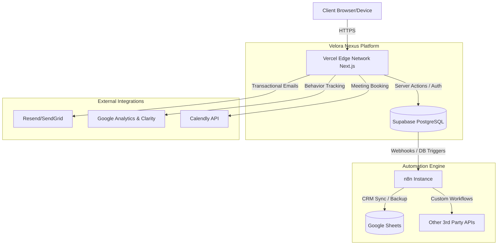

# Velora Nexus SaaS Platform Architecture Proposal

## 1. Overview of Velora Nexus
Velora Nexus is a state-of-the-art SaaS platform tailored for agencies to manage operations, clients, sales pipelines, and projects from a centralized, high-performance dashboard. Built with scalability and security as core principles, the platform incorporates a robust multi-tenant architecture, allowing multiple agencies to operate securely within their own distinct workspaces. It provides an intuitive interface with enterprise-grade features such as automated workflows, seamless analytics, and dynamic CRM capabilities, removing friction from day-to-day agency management.

## 2. Detailed Tech Stack Description

### Frontend
- **Framework:** Next.js (App Router) for hybrid static & server-side rendering, ensuring blazing-fast page loads and excellent SEO.
- **Language:** TypeScript for end-to-end type safety, reducing runtime errors and improving developer experience.
- **Styling:** Tailwind CSS for rapid, utility-first UI development, allowing strict adherence to the design system.
- **Components:** ShadCN UI for accessible, highly customizable, and unstyled Radix UI-based components that can be cleanly tailored to the Velora Nexus brand.
- **Animations:** Framer Motion to provide fluid page transitions, micro-interactions, and a premium feel.

### Backend & Database
- **Runtime & APIs:** Node.js powered via Next.js API Routes and Server Actions for secure backend logic execution.
- **Backend as a Service (BaaS):** Supabase provides a robust PostgreSQL database, real-time subscriptions, user authentication, and scalable file storage.

### Integrations & Tooling
- **Automation:** n8n for building complex webhooks and automated background workflows connecting Velora Nexus with external services.
- **Analytics:** Google Analytics & Microsoft Clarity for tracking user behavior, performance metrics, session recordings, and engagement insights.
- **Meeting Scheduling:** Calendly integrated natively to facilitate client and lead appointments without leaving the platform.
- **CRM Syncing:** Google Sheets integration (via Google Workspace APIs or n8n) for automated dual-entry CRM backups.
- **Email Service:** Resend (or SendGrid) for high-deliverability transactional emails, notifications, and marketing communications.
*(Note: As requested via the audio message, Payment Processing has been omitted from this architecture since those services are not currently offered.)*

### Hosting & Infrastructure
- **Platform:** Vercel for zero-configuration, edge-optimized Next.js hosting, continuous integration/deployment (CI/CD), and serverless functions.

## 3. User Interface Mockups & Design System

### Aesthetic Vision
The design language draws heavy inspiration from Stripe, Linear, and Vercel. 
- **Visuals:** Minimalistic layouts, subtle borders, soft shadows, rounded corners, and sophisticated typography (e.g., Inter or Geist).
- **Theming:** Flawless dark and light mode support with a carefully curated, high-contrast color palette to reduce eye strain.

### Layout Structure
- **Sidebar Navigation:** A persistent, collapsible sidebar containing sections:
  - Velora HQ (Main Dashboard / Overview)
  - Clients (Client management and directories)
  - Leads (Sales pipeline and prospecting)
  - Projects (Task and milestone tracking)
  - Team (Internal roster and permissions)
  - Analytics (Aggregated performance data)
  - Finance (Invoicing and billing records)
  - Automation (n8n workflow monitoring)
  - Chatbot (AI assistant configurations / logs)
  - Settings (Workspace and user configurations)
- **Top Header:** Contains global search (Command-K interface), notifications bell, and user/workspace switcher.
- **Main Content Area:** Dynamic rendering of widgets, data tables, and interactive boards.

### Key UI Components
- **Dashboards:** Data-rich analytics widgets and performance charts.
- **Pipeline Management:** Smooth, drag-and-drop Kanban boards for tracking lead pipelines and project statuses.
- **Client Cards:** Detailed, modular views featuring WhatsApp chat quick-links, recent communications, and document repositories.
- **Financials:** Professional invoice generators with instant PDF export capabilities.

## 4. Integration Flowcharts

The following diagram illustrates how user requests invoke services across the stack:

## 5. Multi-Tenant Architecture Explanation

To securely support multiple companies, Velora Nexus employs a **Logical Isolation** approach within a single shared database (Pool-based tenancy).

- **Workspace ID Routing:** Every organizational account is assigned a unique `workspace_id`. All resources (clients, leads, projects) are strictly tied to this ID.
- **PostgreSQL Row Level Security (RLS):** Supabase's RLS policies are the cornerstone of the platform's security. Database queries automatically filter records based on the authenticated user's assigned `workspace_id` injected via secure JWT claims. This makes cross-tenant data leakage virtually impossible at the core database level, regardless of frontend or API bugs.
- **Role-Based Access Control (RBAC):** Users are assigned roles (e.g., Owner, Admin, Member, Viewer) tied directly to their tenant, governing authorization for destructive actions or sensitive financial data access.

## 6. Security & Data Protection

- **Authentication:** Managed by Supabase Auth (JWT-based), ensuring enterprise-grade secure password hashing and out-of-the-box support for Multi-Factor Authentication (MFA) and Single Sign-On (SSO).
- **Data Privacy:** 
  - Absolute data isolation between tenants via Postgres RLS.
  - Sensitive lead details, communications, and internal team data are encrypted at rest by Supabase.
- **Compliance Considerations:** Ensuring all integrations (especially Calendly and email providers) follow strict data processing agreements aligned with GDPR and CCPA best practices. No Personally Identifiable Information (PII) is sent to Google Analytics or Microsoft Clarity to maintain user privacy.
